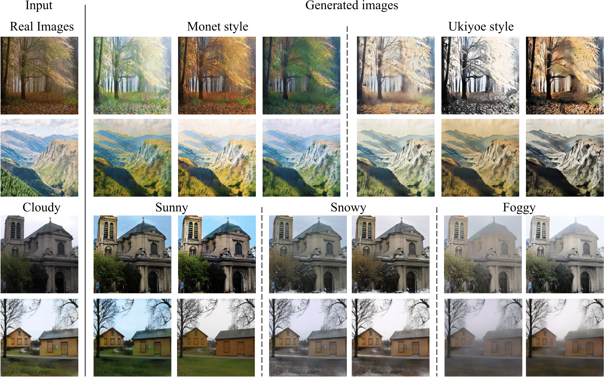

# Multi-Domain Multi-Modality I2I translation

Pytorch implementation of multi-modality I2I translation for multi-domains. The project is an extension to the "Diverse Image-to-Image Translation via Disentangled Representations(https://arxiv.org/abs/1808.00948)", ECCV 2018.
With the disentangled representation framework, we can learn diverse image-to-image translation among multiple domains.
[[DRIT]](https://github.com/HsinYingLee/DRIT)

Contact: Hsin-Ying Lee (hlee246@ucmerced.edu) and Hung-Yu Tseng (htseng6@ucmerced.edu)

## Example Results


### Prerequisites
- Python 3.5 or Python 3.6
- Pytorch 0.4.0 and torchvision (https://pytorch.org/)
- [TensorboardX](https://github.com/lanpa/tensorboard-pytorch)
- [Tensorflow](https://www.tensorflow.org/) (for tensorboard usage)
- Docker file based on CUDA 9.0, CuDNN 7.1, and Ubuntu 16.04 is provided in the [[DRIT]](https://github.com/HsinYingLee/DRIT) github page.

## Usage
- Training
```
python train.py --dataroot DATAROOT --name NAME --num_domains NUM_DOMAINS --display_dir DISPLAY_DIR --result_dir RESULT_DIR --isDcontent
```
- Testing
```
python test.py --dataroot DATAROOT --name NAME --num_domains NUM_DOMAINS --out_dir OUT_DIR --resume MODEL_DIR --num NUM_PER_IMG
```

## Datasets
We validate our model on two datasets:
- art: Containing three domains: real images, Monet images, uki-yoe images. Data can be downloaded from CycleGAN [website](https://github.com/junyanz/pytorch-CycleGAN-and-pix2pix).
- weather: Containing four domains: sunny, cloudy, snowy, and foggy. Data is randomly selected from the Image2Weather dataset [website](https://www.cs.ccu.edu.tw/~wtchu/projects/Weather/index.html).

The different domains in a dataset should be placed in folders "trainA, trainB, ..." in the alphabetical order.

## Models
- The pretrained model on the art dataset
```
bash ./models/download_model.sh art
```
- The pretrained model on the weather dataset
```
bash ./models/download_model.sh weather
```

## Note
- The feature transformation (i.e. concat 0) is not fully tested since both art and weather datasets do not require shape variations
- The hyper-parameters matter and are task-dependent. They are not carefully selected yet.
- Feel free to contact the author for any potential improvement of the code.

## Paper
Diverse Image-to-Image Translation via Disentangled Representations<br>
[Hsin-Ying Lee](http://vllab.ucmerced.edu/hylee/)\*, [Hung-Yu Tseng](https://sites.google.com/site/hytseng0509/)\*, [Jia-Bin Huang](https://filebox.ece.vt.edu/~jbhuang/), [Maneesh Kumar Singh](https://scholar.google.com/citations?user=hdQhiFgAAAAJ), and [Ming-Hsuan Yang](http://faculty.ucmerced.edu/mhyang/)<br>
European Conference on Computer Vision (ECCV), 2018 (**oral**) (* equal contribution)

Please cite our paper if you find the code or dataset useful for your research.
```
@inproceedings{DRIT,
  author = {Lee, Hsin-Ying and Tseng, Hung-Yu and Huang, Jia-Bin and Singh, Maneesh Kumar and Yang, Ming-Hsuan},
  booktitle = {European Conference on Computer Vision},
  title = {Diverse Image-to-Image Translation via Disentangled Representations},
  year = {2018}
}
